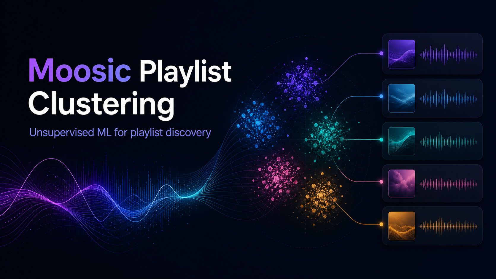

# Moosic Playlist Clustering



An unsupervised machine learning project that uses Spotify-style audio features to group songs into playlist candidates with K-Means clustering.

The objective was not to create a presentation. The goal was to **build playlists from song clusters, listen to the resulting groups, and evaluate whether the playlists actually make sense musically**. A second important question was: **what extra information would improve the clustering beyond audio features alone?**

## Project Goal

Moosic is a fictional music product that wants to create playlists automatically. This project explores whether unsupervised learning can group songs into meaningful playlist categories using only track-level audio features.

The project focuses on three questions:

- Can K-Means identify useful song groups from audio features?
- Do the resulting playlists feel coherent when listened to?
- What additional data would be needed to create better playlist recommendations?

## Dataset

The repository includes two CSV files:

- `data/spotify_10_songs.csv`: a small starter dataset used to understand K-Means behavior manually.
- `data/spotify_5000_songs.csv`: the main dataset used for playlist clustering.

The data contains song metadata and audio features such as:

- `danceability`
- `energy`
- `loudness`
- `speechiness`
- `acousticness`
- `instrumentalness`
- `liveness`
- `valence`
- `tempo`

## Methodology

1. **Explore audio features**
   - Inspect feature distributions and understand how variables such as energy, acousticness, tempo, and valence differ across songs.

2. **Prepare features**
   - Remove non-modeling columns such as song name, artist, URLs, IDs, and technical metadata where appropriate.
   - Compare scaling methods, including MinMaxScaler, StandardScaler, RobustScaler, QuantileTransformer, and PowerTransformer.

3. **Evaluate cluster options**
   - Use K-Means clustering.
   - Compare cluster counts with inertia/elbow analysis and silhouette score.
   - Use dimensionality reduction such as PCA and t-SNE to inspect cluster separation visually.

4. **Create playlists**
   - Assign cluster labels to songs.
   - Build playlist candidates from the resulting clusters.
   - Name playlists based on their audio-feature profiles.

5. **Listen and evaluate**
   - Check sample songs from each playlist.
   - Judge whether the cluster feels musically coherent.
   - Identify where audio features alone are not enough.

## Key Learning

K-Means can create useful first-pass playlist groups, especially when songs differ strongly in energy, danceability, acousticness, instrumentalness, and tempo. However, audio features alone do not fully capture why people choose songs.

To improve playlist quality, a real recommendation system would need additional information such as:

- user listening behavior
- skips, replays, likes, and saves
- playlist adds and removals
- listening context, such as workout, focus, commute, party, or sleep
- time of day and session history
- genre and mood labels
- artist similarity
- collaborative filtering signals from similar listeners
- user feedback on generated playlists

This is the most important product insight from the project: **clustering can organize songs, but recommendation quality improves when audio similarity is combined with behavior and context.**

## Repository Structure

```text
.
├── assets/
│   └── banner.png
├── data/
│   ├── spotify_10_songs.csv
│   └── spotify_5000_songs.csv
├── docs/
│   └── project-summary.md
├── notebooks/
│   ├── 01_kmeans_small_playlist_demo.ipynb
│   └── 02_playlist_clustering_pipeline.ipynb
├── src/
│   └── playlist_clustering.py
├── .gitignore
├── README.md
└── requirements.txt
```

## Setup

Create a virtual environment and install dependencies:

```bash
python3 -m venv .venv
source .venv/bin/activate
pip install -r requirements.txt
```

Run the notebooks in order:

1. `notebooks/01_kmeans_small_playlist_demo.ipynb`
2. `notebooks/02_playlist_clustering_pipeline.ipynb`

## Skills Demonstrated

- Python
- pandas
- scikit-learn
- K-Means clustering
- unsupervised machine learning
- feature scaling
- PCA and t-SNE visualization
- model evaluation with inertia and silhouette score
- playlist/product thinking
- communicating model limitations and next data needs

## Project Status

This repository is ready as a portfolio project. It shows both the technical workflow and the business/product reflection needed to turn clustering results into useful playlists.
